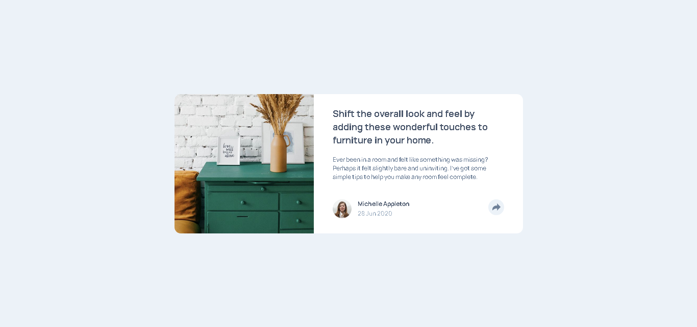

# article-preview-component
This is a solution to the [Article preview component challenge on Frontend Mentor](https://www.frontendmentor.io/challenges/article-preview-component-dYBN_pYFT).

## Table of contents
- [Overview](#overview)
  - [The challenge](#the-challenge)
  - [Screenshot](#screenshot)
  - [Links](#links)
- [My process](#my-process)
  - [Built with](#built-with)
  - [What I learned](#what-i-learned)
  - [Useful resources](#useful-resources)
- [About me](#about-me)

## Overview

### The challenge
Users should be able to:
- View the optimal layout for the component depending on their device's screen size.
- See the social media share links when they click the share icon.

### Screenshot

### Links
- [Challenge's website](https://www.frontendmentor.io/challenges/article-preview-component-dYBN_pYFT)
- [Live solution page](https://stibojeda.github.io/article-preview-component/)
- [Code repository](https://github.com/stibojeda/article-preview-component)

## My process

### Built with
- Semantic HTML5 markup
- CSS custom properties
- Flexbox
- JavaScript DOM

### What I learned
I practiced my CSS skills and, the most important for me was my learning of new knowledges of JavaScript DOM while I was working in this project.

### Useful resources
- [MDN documentation](https://developer.mozilla.org/en-US/docs/Web/CSS)
- [Free Code Camp](https://www.youtube.com/watch?v=XqFR2lqBYPs)
- [Document Object Model in MDN documentation](https://developer.mozilla.org/en-US/docs/Web/API/Document_Object_Model)

## About me
- Portfolio: [Stiven Ojeda](https://stibojeda.github.io)
- Linkedin: [Stiven Ojeda](https://www.linkedin.com/in/stiven-ojeda-090a3924a)
- GitHub: [Stiven Ojeda] (https://github.com/stibojeda)
